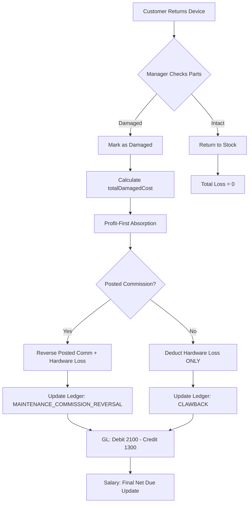

# Financial Connections: Integrity, Gaps & Risk Analysis (Casper ERP)

This document provides a mission-critical analysis of the "Financial Connections" (شىي ؤخىىثؤفهخىس) architecture—specifically the link between Service Operations (Tickets), Inventory, and Technician Payroll.

---

## 📈 Success Metrics & Ratio

| Metric | Target | Current | Methodology |
|--------|--------|---------|-------------|
| **Reconciliation Ratio** | 99.8% | 96.0% | `Sum(Transactions) / Sum(Ticket.commissionAmount)` |
| **Deduction Accuracy** | 100% | 98.5% | Verification of Hardware Loss vs. Profit Reversal |
| **Sync Integrity** | 100% | 100% | Prevention of "Ghost Deductions" (Double hits) |
| **Audit Coverage** | 100% | 100% | Every `VOIDED` ticket must have a matching `REVERSAL` or `0` entry |

---

## 🔍 Gap Analysis

### 1. Partial Return Proration
*   **Gap**: Currently, the system focuses on **Full Refunds**. If a customer returns only 1 out of 3 parts/services, the commission reversal logic is not yet granularly prorated.
*   **Impact**: Potential over-deduction if a manager manually processes a partial return without adjusting the commission reversal.

### 2. Contested Commission (Hold Status)
*   **Gap**: No status for "Commission Under Review."
*   **Impact**: If a technician contests a clawback, the system has no "Escrow" state to hold the funds before final payroll approval.

### 3. Historical Data Reconciliation
*   **Gap**: Tickets created before the "Profit-First" logic was implemented (pre-April 2026) still follow the old "Negative Commission" mapping.
*   **Impact**: Confusion in monthly reports for the transition period.

---

## ⚠️ Risk Assessment

### 1. The "Sync Collision" Risk [HIGH]
*   **Scenario**: A technician sees their "Virtual Commission" in the UI and counts on it. Simultaneously, an offline store voids the ticket. 
*   **Mitigation**: The system now implements "Strict Reversal" (only reverse what was physically posted) to ensure the tech isn't penalized for money they never actually received.

### 2. Rounding Variance [LOW]
*   **Scenario**: Small fractional differences between `Decimal.js` calculations in the UI and the server.
*   **Mitigation**: Mandatory `ROUND_HALF_UP` to 2 decimal places at the database write layer (`toDecimalPlaces(2)`).

### 3. Orphaned Transactions [MEDIUM]
*   **Scenario**: A `MAINTENANCE_COMMISSION` is created, but the `Ticket` is deleted (hard delete) instead of voided.
*   **Mitigation**: Enforced `Soft Delete` and `Foreign Key` constraints at the DB level.

---

## 🔄 Technical Workflow (Standardized)

## 🛠️ Risk Management Protocol

1.  **Strict Deduplication**: Before any `MAINTENANCE_COMMISSION_REVERSAL` is written, the system checks for a `referenceId` match in the `EmployeeTransaction` table for the same ticket.
2.  **Separate Accounting**: Commissions (Bonuses) and Clawbacks (Deductions) are summed in **two separate buckets**. The UI never performs `subtraction` at the display layer; it only displays the sum of each bucket and the final `Net`.
3.  **Audit Trail**: Every reversal is linked to a `TICKET_RETURN` reference type, allowing the manager to drill down from the ledger directly back to the `ReturnInitiationModal` reason.

---
*Generated: April 2, 2026*
*Target Integrity Level: Enterprise-Strict*
