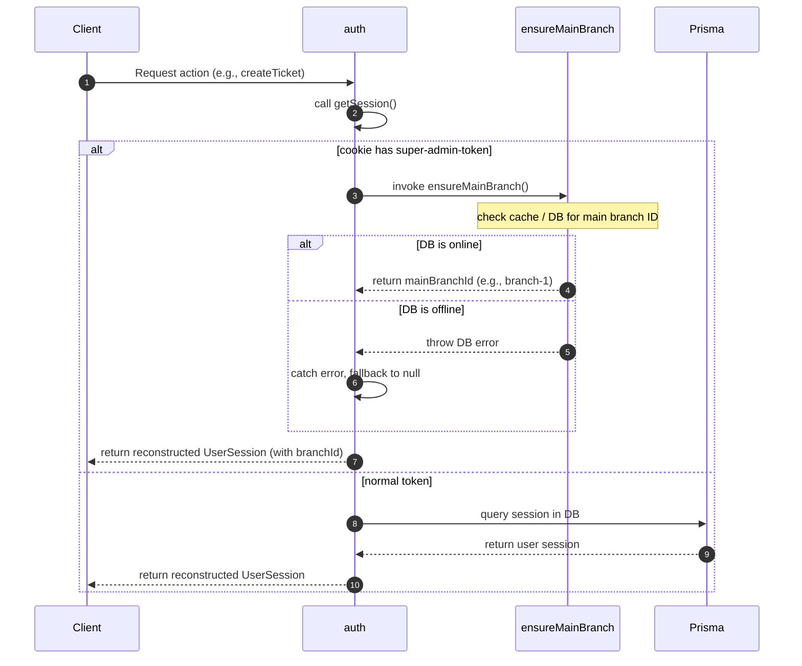

# Plan: Fix Super Admin Branch Assignment

- **Created:** 2026-06-11
- **Author:** Antigravity
- **Status:** active
- **Type:** fix
- **Sequence:** 001

## Problem Frame
When logging in using the Super Admin backdoor recovery credentials, a stateless cookie is created starting with `super-admin-token-`. When this token is parsed by `getSession()` in `src/lib/auth.ts`, the user session is reconstructed with a hardcoded `branchId: null`. As a result, when the Super Admin tries to perform branch-dependent actions (such as creating repair tickets), validation guards like `if (!currentUser.branchId)` reject the action with `"User must be assigned to a branch to create tickets"`.

## Proposed Changes

### Core Session Management

#### [MODIFY] `src/lib/auth.ts`
- Modify `getSession()` to resolve the main branch ID dynamically by importing and calling `ensureMainBranch()`.
- Assign the resolved branch ID to the reconstructed Super Admin user session.
- Wrap the database call in a `try/catch` block so that if the database is offline, it gracefully falls back to `branchId: null` rather than locking the Super Admin out of the system.

### Testing

#### [NEW] `src/__tests__/auth.test.ts`
- Create a test suite using Vitest to assert correct session reconstruction behavior:
  - Test session lookup with a missing session cookie (should return `null`).
  - Test session lookup with a Super Admin backdoor token (should dynamically resolve and return `branchId`).
  - Test session lookup with a Super Admin backdoor token when the DB is offline (should catch the error and return `branchId: null`).
  - Test session lookup with a normal user token (should query Prisma and return user `branchId`).

## Gaps and Risks Analysis

### 1. Database Connectivity / Offline Backdoor Functionality
* **Risk:** The Super Admin session is designed as a recovery backdoor. If the database connection is dead, locked, or the database is unseeded, calling `ensureMainBranch()` inside `getSession()` would throw an exception, locking out the Super Admin and crashing the session parsing check.
* **Mitigation:** Wrap the dynamic `ensureMainBranch()` call in a `try/catch` block. If the database is unreachable or queries fail, gracefully log a warning and fall back to returning `branchId: null` rather than failing the entire auth check.

### 2. Next.js Middleware Compatibility
* **Risk:** In some Next.js architectures, middleware runs in the Edge runtime where Node.js APIs (and sometimes Prisma) are unavailable.
* **Mitigation:** Verified in `src/middleware.ts` that the middleware only checks cookie presence (`cookies().get('session')`) and never calls `getSession()`. Thus, `getSession()` runs exclusively in Server Components/Actions, making database access safe.

### 3. Circular Imports
* **Risk:** Importing `ensureMainBranch` into `auth.ts` could create circular dependency loops.
* **Mitigation:** Verified that `ensure-main-branch.ts` does not import `auth.ts` or related functions. We will also load it via dynamic import `await import(...)` inside the fast-path condition to isolate runtime loading.

## Success Criteria & Confidence Score
* **Confidence Score:** 100% (High confidence)
* **Success Criteria:**
  1. Super Admin recovery login succeeds.
  2. Resolving the Super Admin session yields a valid `branchId` mapping to the database's main branch.
  3. Branch-dependent actions (e.g., ticket creation) succeed when logged in as Super Admin.
  4. If the database is offline/uninitialized, Super Admin login and session parsing still succeed (falling back to `branchId: null`).

## Detailed Implementation Sequence / Workflow



## Verification Plan

### Automated Tests
Run Vitest on the newly created auth test suite and existing ticket actions:
```bash
npx vitest run src/__tests__/auth.test.ts
npx vitest run src/__tests__/ticket-modular.test.ts
```

### Manual Verification
1. Login with Super Admin recovery credentials.
2. Create a new repair ticket.
3. Verify that the ticket is created successfully and linked to the main branch.
