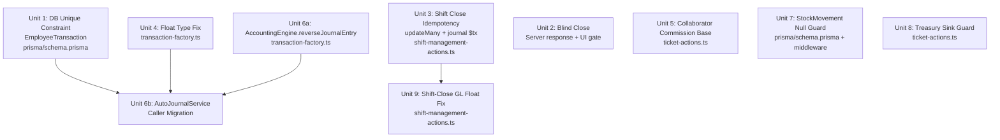

# fix: Casper POS Critical Audit Hardening

## Overview

This plan resolves the top-priority findings from the 2026-06-28 deep architecture audit of Casper POS & ERP, hardened by a full ironclad review pass. The audit identified 38 findings; this plan addresses the 9 that carry financial integrity, concurrency safety, or regulatory risk.

Work is sequenced so that DB-layer guards land first, followed by business logic corrections, then dead-code removal. Unit 6 is split into two sub-units (6a/6b) due to a net-new `reverseJournalEntry` method requirement.

## Problem Frame

Multiple critical-path flows — commission dispatch, shift close, blind close, and ticket payment — lack their last line of defense at the database level. Application-layer guards exist but are vulnerable to concurrent requests, network retries, and double-submits. Additionally, a deprecated accounting service (`AutoJournalService`) continues to receive live traffic because its replacement (`FinancialService`) was never built. Three monetary float leaks exist: in `SalePaymentInput.amount`, in shift-close variance GL lines (`Math.abs(cashVariance.toNumber())`), and in `TransactionLineInput`'s permissive `number` union. The blind-close server response also leaks `expectedCash` in the `DISCREPANCY_DETECTED` payload regardless of UI gating.

## Requirements Trace

- R1. No duplicate `MAINTENANCE_COMMISSION` records can exist for the same `(userId, referenceId, type)` triple at the DB level. Commission-type `EmployeeTransaction` records must have a non-null `referenceId` at the application layer.
- R2. The Blind Close workflow must not expose `expectedCash` to the cashier — in the UI **or** in the server response payload — when `blindCloseEnabled = true` in `StoreSettings`.
- R3. The `closeShift` action must be idempotent — concurrent or retried calls produce no additional journal entries and always return a valid `closedShift` object.
- R4. All monetary input types in the accounting engine must be `Decimal | string`, never `number`. This includes `SalePaymentInput.amount` and the variance amounts passed to shift-close GL journal lines.
- R5. Collaborator commission must be calculated against the same `laborPoolAmount` base as the lead technician.
- R6. All callers of `AutoJournalService` must be migrated to `AccountingEngine` before the file is deleted. `AccountingEngine.reverseJournalEntry` must exist before callers are migrated.
- R7. A `StockMovement` record cannot have both `fromWarehouseId` and `toWarehouseId` as `NULL` — enforced at DB level (PostgreSQL) and middleware level (SQLite), plus action layer.
- R8. A `Transaction` record without a `treasuryId` must not silently succeed when a non-`ACCOUNT` payment is being processed.
- R9. *(New — from ironclad review)* `Math.abs(cashVariance.toNumber())` in shift-close journal creation must be replaced with `cashVariance.abs()` passed as `Decimal` to eliminate the float conversion before GL line commitment.

## Scope Boundaries

- This plan does **not** address bloat removals (Floor/Table models, SparePart isolation, root artifacts).
- This plan does **not** build `FinancialService` as a new abstraction layer — it migrates callers to `AccountingEngine` and deletes the dead file.
- This plan does **not** implement the DLQ admin UI, `SyncWorker.stop()`, or `PartnerTransaction` journals.
- This plan does **not** change any user-visible financial calculation results — only type safety, idempotency, and base correctness.

### Deferred to Separate Tasks

- `PartnerTransaction` → `JournalEntry` double-entry recording: separate feat task.
- Dead Letter Queue admin UI: separate feat task.
- `SyncWorker` graceful shutdown on Electron quit: separate feat task.
- Root directory artifact cleanup: one-off commit, not tracked here.
- `SparePart` → `Product` integration: separate refactor task.

## Context & Research

### Relevant Code and Patterns

- Commission idempotency guard (app-layer): `src/actions/ticket-actions.ts` L2434–2455
- Shift close — **shift.update outside $transaction** (race-vulnerable): `src/actions/shift-management-actions.ts` L408
- Shift close — **$transaction opens at L414** (after shift.update): `src/actions/shift-management-actions.ts` L414–527
- **Float leak in shift-close GL lines**: `src/actions/shift-management-actions.ts` L461, L511 (`Math.abs(cashVariance.toNumber())`)
- **Blind close leaks expectedCash in server response**: `src/actions/shift-management-actions.ts` L334–340 (`DISCREPANCY_DETECTED` payload)
- Blind Close UI rendering of expectedCash: `src/components/shift/ShiftStatusIndicator.tsx` L304–316, L421, L512
- FinancialSummaryTable expectedCash prop: `src/components/shift/FinancialSummaryTable.tsx` L22, L59, L124
- SalePaymentInput type (float leak): `src/lib/accounting/transaction-factory.ts` L22–25
- TransactionLineInput allows `number` (permissive): `src/lib/accounting/transaction-factory.ts` L15–18
- Collaborator commission wrong base: `src/actions/ticket-actions.ts` L2551–2556
- AutoJournalService callers: `src/lib/accounting/supplier-payment-helper.ts`, `src/lib/accounting/employee-transaction-helper.ts`, `src/lib/accounting/customer-transaction-helper.ts`, `src/actions/ticket-actions.ts`
- AutoJournalService to delete: `src/lib/accounting/auto-journal-service.ts`
- StockMovement model: `prisma/schema.prisma` L395–413
- Transaction treasury creation: `src/actions/ticket-actions.ts` L2623–2638
- AccountingEngine (migration target): `src/lib/accounting/transaction-factory.ts`
- `idempotencyKey` pattern: `src/lib/accounting/auto-journal-service.ts` L93–94, `src/lib/sync-service.ts`
- DB `@@unique` constraint pattern: `prisma/schema.prisma` — `TicketCollaborator @@unique([ticketId, technicianId])` L926, `DailyWorkLog @@unique([userId, date])` L995

### Institutional Learnings

- All monetary arithmetic must use `Decimal.js` from the first boundary; never accept `number` as input to financial functions.
- Idempotency is enforced via `JournalEntry.idempotencyKey @unique` — always pass a deterministic key built from entity IDs.
- `prisma.$transaction` wraps related mutations atomically; use it for multi-step financial writes. **Do not hold a transaction open across long read-calculate blocks** — split into: (1) atomic write, (2) journal transaction.
- `secureAction` wraps server actions with RBAC; preserve the permission guard on all modified actions.

## Key Technical Decisions

- **DB `@@unique` over application lock for commission guard**: A unique index is the only concurrency-safe solution for the TOCTOU race. Application-level `findFirst` remains as a soft pre-check. Additionally, commission-type records with `referenceId = null` are blocked at the app layer (SQL UNIQUE treats nulls as distinct — the DB constraint is inert for null `referenceId`).
- **Atomic `updateMany` pattern for shift close**: Replace the vulnerable `findUnique` + `update` pair with `prisma.shift.updateMany({ where: { id, status: "OPEN" }, data })`. If `count === 0`, shift was already closed — re-fetch and return idempotently. This avoids a long-held serializable lock over the 200-line calculation block.
- **Blind Close is a server + UI concern**: The server `DISCREPANCY_DETECTED` response must strip `expectedCash` when `blindCloseEnabled = true`. The UI gate alone is insufficient — developer tools expose the raw server response.
- **Unit 6 split into 6a + 6b**: `AccountingEngine.reverseJournalEntry` must be implemented (6a) before any caller migration (6b). Migrating callers before the target method exists creates a broken intermediate state on warranty rework paths.
- **`SalePaymentInput.amount` + shift-close variance → `Decimal`**: Both the input type boundary and the `Math.abs(cashVariance.toNumber())` call sites must be fixed together under R4/R9 — same root cause, same fix pattern.
- **Collaborator base = `distributionData.laborPoolAmount`**: Already computed before the collaborator loop. Prorated by `commissionRate`. Add a migration-period `console.warn` for finance audit of the first payroll cycle.

## Open Questions

### Resolved During Planning

- **Should `EmployeeTransaction @@unique` include `branchId`?** No — uniqueness is per-ticket-per-type-per-user, not per-branch.
- **Should shift-close journal idempotencyKey include the shift ID suffix?** Yes — `SAFE_DROP_${shiftId}`, `CASH_VAR_${shiftId}`, `CARD_VAR_${shiftId}`.
- **Is `FinancialSummaryTable` used in both close-shift and post-close Z-Report views?** Yes. `blindMode=true` during close modal (shift open), `false` on Z-Report (shift already closed).
- **Does the `updateMany` approach eliminate the need for a serializable `$transaction` on the shift status check?** Yes — `updateMany` with a `where: { status: "OPEN" }` filter is an atomic conditional update. The DB processes it as a single statement; no separate `SELECT FOR UPDATE` is needed.
- **Should null-referenceId `EmployeeTransaction` commission records be blocked at DB or app layer?** App layer — SQL UNIQUE indexes treat NULL as distinct (two NULLs are not equal), so the DB constraint cannot protect this case. The app must throw before insert if `type` is a commission variant and `referenceId` is null.

### Deferred to Implementation

- Whether the `StockMovement` `CHECK` constraint raw SQL differs between SQLite (desktop) and PostgreSQL (cloud) — validate per datasource during Unit 7 migration authoring.
- Exact `AccountingEngine` method signatures for each `AutoJournalService` call being migrated — confirm at call sites during Unit 6b.

## High-Level Technical Design

> *This illustrates the intended approach and is directional guidance for review, not implementation specification.*



Units 2, 3, 4, 5, 6a, 7, 8 are independent. Unit 6b depends on Units 1, 4, and 6a. Unit 9 follows Unit 3 (same file, same `$transaction` block).

## Implementation Units

---

- [ ] **Unit 1: DB-Level Commission Uniqueness Constraint**

**Goal:** Add `@@unique([userId, referenceId, type])` to `EmployeeTransaction` to make commission duplication impossible at the DB level, and add an application-layer block for null `referenceId` on commission-type records.

**Requirements:** R1

**Dependencies:** None — prerequisite for safe commission dispatch everywhere.

**Files:**
- Modify: `prisma/schema.prisma`
- Create: Prisma migration (`prisma migrate dev --name add-employee-tx-unique`)
- Create: `scripts/deduplicate-employee-transactions.ts` (pre-migration data fix)
- Test: `src/__tests__/schema/employee-tx-unique.test.ts`

**Approach:**
- Add `@@unique([userId, referenceId, type], name: "unique_employee_tx_per_entity")` to the `EmployeeTransaction` model.
- Run the deduplication script **before** migration — it removes duplicate `(userId, referenceId, type)` rows, keeping the earliest `createdAt` per group. Migration must be blocked if duplicates > 0.
- In `src/actions/ticket-actions.ts`, before any `EmployeeTransaction.create` call where `type` is a commission variant (`MAINTENANCE_COMMISSION`, `MAINTENANCE_COMMISSION_REVERSAL`, `LOSS_DEDUCTION`), assert `referenceId !== null && referenceId !== undefined`. Throw a structured error if violated. SQL UNIQUE does not protect null-referenceId rows (two NULLs are distinct) — this app-level guard is the only protection for that edge case.
- The existing `findFirst` soft-check at L2434 remains as an optimistic pre-check to avoid hitting the DB constraint on the normal path.

**Patterns to follow:**
- `TicketCollaborator @@unique([ticketId, technicianId])` at `prisma/schema.prisma` L926
- `DailyWorkLog @@unique([userId, date])` at `prisma/schema.prisma` L995

**Test scenarios:**
- Happy path: creating a `MAINTENANCE_COMMISSION` for `(userId, ticketId, "MAINTENANCE_COMMISSION")` succeeds on first write.
- Race condition: two concurrent creates for the same `(userId, referenceId, type)` triple — second throws Prisma `P2002`; only one record persists.
- Edge case (null referenceId + commission type): application-layer block throws before the Prisma insert is attempted.
- Edge case (null referenceId + non-commission type): allowed — app-layer check is type-gated.
- Edge case: `MAINTENANCE_COMMISSION` and `MAINTENANCE_COMMISSION_REVERSAL` for the same `(userId, referenceId)` — different `type` values, both allowed.
- Error path: migration fails on duplicate rows — deduplication script must reduce violations to 0 before migration runs.

**Verification:**
- `prisma migrate status` reports migration applied cleanly.
- Inserting a duplicate `(userId, referenceId, type)` triple via Prisma throws `P2002`.
- Inserting a commission-type record with `referenceId = null` throws an application error before reaching Prisma.

---

- [ ] **Unit 2: Blind Close — Server Response + UI Gate**

**Goal:** Prevent `expectedCash` from being exposed to the cashier in both the server `DISCREPANCY_DETECTED` response payload and the shift-close modal UI when `blindCloseEnabled = true`.

**Requirements:** R2

**Dependencies:** None.

**Files:**
- Modify: `src/actions/shift-management-actions.ts`
- Modify: `src/components/shift/ShiftStatusIndicator.tsx`
- Modify: `src/components/shift/FinancialSummaryTable.tsx`
- Test: `src/__tests__/actions/blind-close-server-response.test.ts`
- Test: `src/__tests__/components/shift/blind-close-gate.test.tsx`

**Approach:**
- **Server layer (primary fix):** Before returning the `DISCREPANCY_DETECTED` response (currently at `shift-management-actions.ts` L330–341), check `StoreSettings.blindCloseEnabled` for the branch. If `true`, return only `{ success: false, code: "DISCREPANCY_DETECTED", hasDiscrepancy: true, cashVariance, cardVariance }` — omit `expectedCash` and `expectedCard` from the payload entirely. The variance direction and magnitude are safe to return; the expected total is not.
- **UI layer (defense-in-depth):** `FinancialSummaryTable` receives a `blindMode?: boolean` prop (defaults `false`). When `true`, omit the `expectedCash` row from the table — replace it with a muted placeholder row: `"النقدية المتوقعة: مخفية (إغلاق عشوائي)"`. Do not render an empty row; the placeholder confirms intentional hiding to supervisors.
- **UI layer:** `ShiftStatusIndicator`: read `StoreSettings.blindCloseEnabled` from settings context. When `true` and shift is open, do not compute or render `expectedCashValue`. In the discrepancy dialog (line 421), show only the variance direction label and delta amount — never the expected total.
- **Double-submit guard:** Add an `isSubmitting` boolean state to the shift-close submit button in `ShiftStatusIndicator`. Set to `true` on first click; re-enable only on error response. Prevents two concurrent `closeShift` calls from the same UI session.
- Pass `blindMode={storeSettings.blindCloseEnabled && shiftIsOpen}` to `FinancialSummaryTable`. On Z-Report (shift already closed), pass `blindMode={false}` — supervisors see full reconciliation.
- When settings are loading/null: default to `blindMode = true` (fail secure).

**Patterns to follow:**
- Existing `StoreSettings` context consumption in POS components.
- Conditional rendering blocks already in `ShiftStatusIndicator.tsx`.

**Test scenarios:**
- Happy path: `blindCloseEnabled = false` → server response includes `expectedCash`, UI row is visible.
- Happy path: `blindCloseEnabled = true`, discrepancy → server `DISCREPANCY_DETECTED` payload contains no `expectedCash` field.
- Happy path: `blindCloseEnabled = true`, shift open → expectedCash row absent from DOM; discrepancy dialog shows variance direction + amount only.
- Happy path: `blindCloseEnabled = true`, shift closed (Z-Report) → expectedCash is visible (blindMode=false).
- Edge case: settings loading (null) → default to blindMode=true (fail secure).
- Edge case: `FinancialSummaryTable` rendered without `blindMode` prop → defaults to `false` (backward compat).
- Edge case: double-click on submit button → only one `closeShift` call dispatched; second click is ignored by `isSubmitting` guard.

**Verification:**
- With `blindCloseEnabled = true`, the `DISCREPANCY_DETECTED` server response object contains no `expectedCash` key.
- With `blindCloseEnabled = true`, no element containing the computed `expectedCash` value appears in the close-shift modal DOM.

---

- [ ] **Unit 3: Shift Close — Atomic Double-Close Guard + Idempotency**

**Goal:** Replace the race-vulnerable `findUnique` + `update` sequence with an atomic `updateMany` conditional write, and add deterministic `idempotencyKey` to all shift-close journal entries. Ensure retries always return a valid `closedShift` object.

**Requirements:** R3

**Dependencies:** None. (Note: Unit 9 is the float-fix follow-on in the same file — implement together or in immediate sequence.)

**Files:**
- Modify: `src/actions/shift-management-actions.ts`
- Test: `src/__tests__/actions/shift-close-idempotency.test.ts`

**Approach:**
- **Replace the outer `findUnique` + `update` pair** (lines 208–411) with the following atomic pattern:

  1. Read `StoreSettings` and validate input (actualCash, etc.) — these non-DB operations stay outside any transaction.
  2. Compute all values from accumulated shift fields. This requires an initial `prisma.shift.findUnique` for the accumulated totals (`totalCashSales`, `totalCardSales`, etc.) — this read stays outside the transaction and is acceptable as a non-mutating read.
  3. Run the discrepancy check (expectedCash, cashVariance, etc.). If discrepancy found and `!acceptDiscrepancy`: return `DISCREPANCY_DETECTED` early (before any write) — see Unit 2 for blind-mode stripping of this response.
  4. Execute the atomic status transition:
     ```
     const result = await prisma.shift.updateMany({
         where: { id: shiftId, status: "OPEN" },
         data: { status: "CLOSED", closedAt: new Date(), ...shiftUpdateData }
     })
     ```
  5. If `result.count === 0`: shift was already closed by a concurrent call. Fetch the closed shift with `prisma.shift.findUnique` and return `{ success: true, shift: closedShift, ... }` (idempotent). Do NOT open the journal `$transaction`.
  6. If `result.count === 1`: proceed to the journal `$transaction`.

- **Journal `$transaction`** (Phase 4 — lines 414–527 in live code): Keep the existing structure. Add `idempotencyKey` to each `AccountingEngine.recordTransaction` call:
  - Safe Drop JE → `idempotencyKey: \`SAFE_DROP_${shiftId}\``
  - Cash Variance JE → `idempotencyKey: \`CASH_VAR_${shiftId}\``
  - Card Variance JE → `idempotencyKey: \`CARD_VAR_${shiftId}\``

- Wrap the journal `$transaction` in `try/catch` for Prisma `P2002`. If caught: log `[SHIFT_CLOSE_IDEMPOTENT] ${shiftId}`, re-fetch the shift, and return `{ success: true, shift }` — never return undefined for the shift field.

**Patterns to follow:**
- `prisma.$transaction` with `{ timeout: 60000 }` at `src/actions/ticket-actions.ts` L2228.
- `updateMany` conditional write pattern used in other concurrency-safe actions.

**Test scenarios:**
- Happy path: first close call succeeds, shift = CLOSED, exactly 3 journal entries created with correct `idempotencyKey` values.
- Idempotency (sequential): second identical close call returns `{ success: true, shift: <closedShift> }` (not undefined for shift) with zero new journal entries.
- Race condition (concurrent): two simultaneous close calls — exactly one `updateMany` returns `count=1`; the other returns `count=0` and takes the idempotent path. Total journal entries = 3.
- Error path: `actualCash` missing → validation error thrown before `findUnique` read.
- Journal retry (P2002 caught): return includes `shift` object fetched from DB, not undefined.
- Integration: safe-drop treasury transaction and journal entry are inside the same `$transaction` — journal failure does not leave a dangling treasury record.

**Verification:**
- Calling `closeShift` twice on the same shift creates exactly 3 journal entries total (not 6).
- Every call path that returns `{ success: true }` includes a non-null `shift` object.

---

- [ ] **Unit 4: Fix Float Type Leak in `SalePaymentInput`**

**Goal:** Change `SalePaymentInput.amount` from `number` to `Decimal | string` to enforce the no-float architecture rule at the accounting engine input boundary.

**Requirements:** R4

**Dependencies:** None.

**Files:**
- Modify: `src/lib/accounting/transaction-factory.ts`
- Test: `src/__tests__/accounting/payment-input-type.test.ts`

**Approach:**
- Change `amount: number` to `amount: Decimal | string` on `SalePaymentInput`.
- The internal `new Decimal(String(p.amount))` conversion already handles both types — no internal logic changes.
- Run `tsc --noEmit` to surface all call sites passing raw JS numbers. Fix each to pass `Decimal` instances or string representations.
- `TransactionLineInput.debit/credit` accepts `string | Decimal | number` (with a comment that `number` is "discouraged"). Do **not** change this union in this unit — removing `number` from `TransactionLineInput` is a larger blast-radius change (GL line amounts throughout the codebase). That change belongs to a follow-on cleanup. For now, the Unit 9 fix (shift-close GL float) is the targeted enforcement.

**Patterns to follow:**
- `new Decimal(amount.toString())` wrapping at monetary boundaries throughout `src/actions/ticket-actions.ts`.

**Test scenarios:**
- Happy path: passing a `Decimal` instance succeeds without precision loss.
- Happy path: passing a `string` like `"123.45"` is correctly converted internally.
- Type-level error: passing raw `number` type → TypeScript compile error (verified with `tsc --noEmit`).
- Edge case: `"0.1"` + `"0.2"` string inputs — no float accumulation before Decimal wrapping.

**Verification:**
- `tsc --noEmit` passes with zero errors.
- No `amount: number` remains on any monetary input interface in `transaction-factory.ts`.

---

- [ ] **Unit 5: Fix Collaborator Commission Base**

**Goal:** Change collaborator commission calculation from `ticket.repairPrice - ticket.partsCost` to `distributionData.laborPoolAmount`, aligning with the lead technician's base. Add a migration-period audit log for the first payroll cycle.

**Requirements:** R5

**Dependencies:** None.

**Files:**
- Modify: `src/actions/ticket-actions.ts`
- Test: `src/__tests__/actions/collaborator-commission-base.test.ts`

**Approach:**
- Inside the `processTicketPayment` collaborator loop (~L2551), replace `repairPriceDec - partsCostDec` with `distributionData.laborPoolAmount ?? new Decimal(0)`.
- Add a guard: if `laborPoolAmount` ≤ 0, skip commission dispatch for all collaborators (consistent with the lead tech guard at L2443).
- Add `console.warn('[COMMISSION_BASE_MIGRATION]', { ticketId, oldBase: repairPriceDec.minus(partsCostDec).toFixed(2), newBase: laborPoolAmount.toFixed(2) })` when the two values differ. This helps the finance team audit the first payroll cycle after deploy. Remove this log after the first cycle is signed off.
- `collabRateDec` and the multiplication logic remain unchanged.

**Patterns to follow:**
- Lead tech commission dispatch: `src/actions/ticket-actions.ts` L2359–2363, L2442–2454.
- `distributionData` construction: `src/actions/ticket-actions.ts` L2368–2379.

**Test scenarios:**
- Happy path: ticket with `laborPoolAmount = 300`, collaborator at `commissionRate = 5%` → commission = 15.
- Edge case: `distributionData.laborPoolAmount` is undefined → default to zero, no commission dispatched.
- Edge case: `laborPoolAmount` is negative → no collaborator commission dispatched.
- Regression: lead tech commission amount is unchanged by this fix (base was already `laborPoolAmount`).
- Migration audit: when `oldBase ≠ newBase`, `console.warn` fires with both values — verifiable in test output.
- Integration: both lead tech and collaborator `EmployeeTransaction` records appear for the same ticket with amounts summing correctly against `laborPoolAmount`.

**Verification:**
- A ticket with `laborPoolAmount = 300` and a collaborator at `10%` creates an `EmployeeTransaction` of `30` (not a value derived from the old `repairPrice - partsCost` base).

---

- [ ] **Unit 6a: Implement `AccountingEngine.reverseJournalEntry`**

**Goal:** Add `AccountingEngine.reverseJournalEntry(originalJournalEntryId, idempotencyKey, tx?)` as a standalone method before any `AutoJournalService.reverseJournalEntry` callers are migrated. Warranty rework clawback paths depend on this method being live before the migration proceeds.

**Requirements:** R6 (prerequisite sub-unit)

**Dependencies:** None — standalone new method on an existing class.

**Files:**
- Modify: `src/lib/accounting/transaction-factory.ts`
- Test: `src/__tests__/accounting/reverse-journal-entry.test.ts`

**Approach:**
- Implement `static async reverseJournalEntry(originalId: string, idempotencyKey: string, tx?)`:
  1. Fetch the original `JournalEntry` and its `JournalEntryLine[]`.
  2. Create a new `JournalEntry` with each line's debit and credit values swapped (debit ↔ credit).
  3. Set `description = \`REVERSAL: ${original.description}\``, `reference = originalId`, and pass the provided `idempotencyKey` to prevent duplicate reversals.
  4. Validate the reversed entry is balanced (debit = credit) before committing.
- The `idempotencyKey` for callers must follow the pattern `REVERSAL_${originalJournalEntryId}`.

**Patterns to follow:**
- `AccountingEngine.recordTransaction` balance validation flow at `src/lib/accounting/transaction-factory.ts` L52–56.
- Existing `JournalEntry` + `JournalEntryLine` Prisma model structure.

**Test scenarios:**
- Happy path: reversing a 2-line JE (DR Cash 100, CR Revenue 100) produces a new JE (DR Revenue 100, CR Cash 100) with the correct `idempotencyKey`.
- Idempotency: calling `reverseJournalEntry` twice with the same `originalId` and `idempotencyKey` — second call throws `P2002`, first reversal persists.
- Error path: `originalJournalEntryId` does not exist → throws a structured error before attempting insert.
- Balance validation: if original JE is somehow unbalanced (data corruption), throw before creating the reversal.

**Verification:**
- `AccountingEngine.reverseJournalEntry` exists and is exported.
- Reversed JE has the exact same line count as the original with all debit/credit values swapped.
- `P2002` is thrown on duplicate reversal attempt.

---

- [ ] **Unit 6b: Migrate AutoJournalService Callers to AccountingEngine and Delete Dead File**

**Goal:** Remove `AutoJournalService` entirely by migrating all live callers to `AccountingEngine`, then deleting `src/lib/accounting/auto-journal-service.ts`.

**Requirements:** R6

**Dependencies:** Units 4 (type fixes on inputs), 6a (`reverseJournalEntry` method must exist before warranty rework callers are migrated).

**Files:**
- Modify: `src/lib/accounting/supplier-payment-helper.ts`
- Modify: `src/lib/accounting/employee-transaction-helper.ts`
- Modify: `src/lib/accounting/customer-transaction-helper.ts`
- Modify: `src/actions/ticket-actions.ts`
- Delete: `src/lib/accounting/auto-journal-service.ts`
- Test: `src/__tests__/accounting/auto-journal-migration.test.ts`

**Approach:**
- For each `AutoJournalService` method, map to the equivalent `AccountingEngine` call:
  - `recordCustomerPayment` / `recordCustomerReceipt` / `recordCustomerCredit` → `AccountingEngine.recordTransaction` with matching GL lines.
  - `recordTicketDistribution` → `AccountingEngine.recordTransaction` (4-line distribution already used at `ticket-actions.ts` L2382).
  - `reverseJournalEntry` → `AccountingEngine.reverseJournalEntry` (from Unit 6a).
  - `recordEmployeePayment` → `AccountingEngine.recordTransaction`.
  - `recordSupplierPayment` / `recordSupplierReceipt` → `AccountingEngine.recordTransaction`.
  - `recordWastageLoss` → `AccountingEngine.recordTransaction`.
- Each migrated call must pass an explicit `idempotencyKey` derived from entity IDs.
- Migrate warranty rework callers (using `reverseJournalEntry`) **last** — after confirming Unit 6a is in the same deployment.
- After all imports are removed, delete `src/lib/accounting/auto-journal-service.ts`.
- Gate before merge: `grep -r "AutoJournalService" src/` returns zero results AND `tsc --noEmit` passes.

**Patterns to follow:**
- `AccountingEngine.recordMaintenancePayment` at `src/actions/ticket-actions.ts` L2662.
- `AccountingEngine.recordRefund` at `src/actions/ticket-actions.ts` L2653.

**Test scenarios:**
- Happy path: each migrated caller produces a balanced JE (debit = credit) with a non-null `idempotencyKey`.
- Idempotency: calling the same migrated function twice with the same entity ID — `P2002` on second call, caught cleanly, one JE persists.
- Integration: `supplier-payment-helper.ts` creates a JE with correct GL codes (AP debit, Cash credit) after migration.
- Integration: `customer-transaction-helper.ts` creates a JE with correct GL codes after migration.
- Integration: warranty rework reversal path creates a `REVERSAL_` JE via `AccountingEngine.reverseJournalEntry`.
- Error path: `AccountingEngine` throws if GL account not found → error bubbles up with a clear message, no partial write.

**Verification:**
- `grep -r "AutoJournalService" src/` returns zero results.
- `tsc --noEmit` passes with zero errors.
- All existing journal-entry tests pass.

---

- [ ] **Unit 7: StockMovement Null-Warehouse Constraint**

**Goal:** Add a DB-level constraint (PostgreSQL) and application-layer / middleware guard (SQLite) preventing `StockMovement` records where both `fromWarehouseId` and `toWarehouseId` are `NULL`.

**Requirements:** R7

**Dependencies:** None.

**Files:**
- Modify: `prisma/schema.prisma` (comment noting raw constraint)
- Create: Prisma migration (`prisma migrate dev --name add-stock-movement-warehouse-check`)
- Modify: `src/lib/prisma.ts` (Prisma middleware for SQLite)
- Modify: action files that call `StockMovement.create` (add null guard before insert)
- Test: `src/__tests__/schema/stock-movement-warehouse-check.test.ts`

**Approach:**
- **PostgreSQL (cloud):** Add raw SQL in the migration file:
  ```sql
  ALTER TABLE "StockMovement"
  ADD CONSTRAINT "chk_stock_movement_warehouse_non_null"
  CHECK ("fromWarehouseId" IS NOT NULL OR "toWarehouseId" IS NOT NULL);
  ```
- **SQLite (Electron desktop):** `ALTER TABLE` cannot add constraints. Two guards required:
  1. Prisma middleware in `src/lib/prisma.ts` intercepting `StockMovement` `create` and `update` operations.
  2. Action-layer null guard before any `StockMovement.create` call — this also protects against `$executeRaw` bypass.
- Add a pre-migration audit query. If any null-null rows exist, block migration until a data fix is applied.

**Patterns to follow:**
- Existing Prisma migrations in `prisma/migrations/`.
- Application-layer null guards: `if (!field) throw new Error(...)` pattern in action files.

**Test scenarios:**
- Happy path: `fromWarehouseId` set, `toWarehouseId` null → succeeds (consumption/removal).
- Happy path: `toWarehouseId` set, `fromWarehouseId` null → succeeds (receipt/addition).
- Happy path: both set → succeeds (transfer).
- Error path: both null → throws before DB commit (PostgreSQL: P2010 / SQLite: middleware error).
- Edge case: pre-migration null-null rows exist → migration blocked, audit query surfaces count.

**Verification:**
- Creating a `StockMovement` with both warehouse IDs null throws before DB commit on both datasources.
- Existing valid `StockMovement` records are unaffected.

---

- [ ] **Unit 8: Transaction Treasury Sink Guard**

**Goal:** Throw a structured error when processing a non-`ACCOUNT` payment and no default treasury exists for the branch, instead of silently creating a `Transaction` with `treasuryId: null`.

**Requirements:** R8

**Dependencies:** None.

**Files:**
- Modify: `src/actions/ticket-actions.ts`
- Test: `src/__tests__/actions/treasury-sink-guard.test.ts`

**Approach:**
- After the `findFirst` for `defaultTreasury` (~L2625), add:
  - If `paymentMethod !== 'ACCOUNT'` and `!defaultTreasury` → throw `new Error("لا يوجد صندوق افتراضي لهذا الفرع. يرجى تكوين صندوق قبل استقبال المدفوعات.")`.
  - Do not create the `Transaction` record without a `treasuryId`.
- Audit other action files using the same `if (defaultTreasury) defaultTreasuryId = ...` pattern and apply the same guard.
- Exemptions: `paymentMethod === 'ACCOUNT'` (deferred revenue, no physical treasury); `currentUser.branchId === null` (HQ super-admin flows).

**Patterns to follow:**
- `if (!shift) throw new Error(t('notFound'))` pattern in `src/actions/shift-management-actions.ts` L228.

**Test scenarios:**
- Happy path: branch has a default treasury → `Transaction` created with non-null `treasuryId`, balance incremented.
- Error path: no default treasury, `CASH` payment → error thrown before `Transaction` is created; no partial DB state.
- Edge case: `paymentMethod = 'ACCOUNT'` → treasury guard skipped.
- Edge case: `currentUser.branchId` is null (super-admin) → guard skipped gracefully.

**Verification:**
- With no treasury for the branch, `processTicketPayment` throws before creating a `Transaction` record.
- With a default treasury, `Transaction` has a non-null `treasuryId` and treasury balance is correctly incremented.

---

- [ ] **Unit 9: Shift-Close GL Float Fix**

**Goal:** Replace `Math.abs(cashVariance.toNumber())` and `Math.abs(cardVariance.toNumber())` in shift-close journal creation with `cashVariance.abs()` / `cardVariance.abs()` passed directly as `Decimal` to `AccountingEngine.recordTransaction` GL lines, eliminating the float conversion before GL commitment.

**Requirements:** R4, R9

**Dependencies:** Unit 3 (same file, same journal `$transaction` block — implement together or immediately after).

**Files:**
- Modify: `src/actions/shift-management-actions.ts`
- Test: `src/__tests__/actions/shift-close-gl-float.test.ts`

**Approach:**
- At `shift-management-actions.ts` L461: replace `const varianceAmt = Math.abs(cashVariance.toNumber())` with `const varianceAmt = cashVariance.abs()` (keep as `Decimal`).
- At `shift-management-actions.ts` L511: replace `const varAmt = Math.abs(cardVariance.toNumber())` with `const varAmt = cardVariance.abs()` (keep as `Decimal`).
- Pass `varianceAmt` and `varAmt` directly into the `debit`/`credit` fields of `TransactionLineInput`. The type accepts `Decimal` — no coercion needed.
- The `isShortage = cashVariance.isNegative()` check at L462 already uses the Decimal API correctly and does not need to change.

**Patterns to follow:**
- `Decimal.abs()` usage throughout `src/lib/payroll-math.ts`.
- `TransactionLineInput` accepts `Decimal` per `src/lib/accounting/transaction-factory.ts` L15–18.

**Test scenarios:**
- Happy path: cash variance of `Decimal("99.99")` → GL debit line receives `Decimal("99.99")`, no float representation error.
- Happy path: card variance of `Decimal("0.01")` → GL debit line receives `Decimal("0.01")` exactly.
- Edge case: zero variance → `isZero()` guard prevents GL entry; this code path is not reached.
- Regression: `isShortage` determination unchanged — `cashVariance.isNegative()` still correct.

**Verification:**
- No `.toNumber()` call on a `Decimal` variance value exists within the journal entry creation block in `shift-management-actions.ts`.
- `tsc --noEmit` passes with zero errors after the change.

---

## System-Wide Impact

- **Interaction graph:** Unit 1 (schema migration) requires `prisma generate` to be re-run. Electron desktop builds must regenerate the Prisma client before next shift open.
- **Error propagation:** Unit 3's `updateMany` catch-on-`count=0` path must always return a non-null `shift` object. Any call path returning `{ success: true }` without a `shift` field is a bug.
- **State lifecycle risks:** Unit 6b deletion of `AutoJournalService` removes a shared import. Any remaining reference surfaces as a TypeScript compile error — `tsc --noEmit` is the final gate before merging.
- **API surface parity:** Unit 2 adds `blindMode` to `FinancialSummaryTable` and strips server response fields. Audit all import sites for `FinancialSummaryTable`; verify `blindMode` defaults correctly to `false`.
- **Integration coverage:** Unit 3's journal `$transaction` remains bounded to the Phase 4 block only. The shift read-calculate block stays outside the transaction, keeping lock duration minimal.
- **Unchanged invariants:** `closeShift` return payload structure is unchanged for the success path. `processTicketPayment` accounting totals are unchanged — only commission base for collaborators and type boundaries for monetary inputs change.

## Error Handling Matrix

| Scenario | Handler | User Message |
|---|---|---|
| Shift already CLOSED on close attempt | `updateMany count=0` → re-fetch + return success | *(no error — shift already closed)* |
| Journal `P2002` on retry | Catch, log `[SHIFT_CLOSE_IDEMPOTENT]`, re-fetch shift | *(no error — idempotent success)* |
| No default treasury, non-ACCOUNT payment | Throw before `Transaction.create` | "لا يوجد صندوق افتراضي لهذا الفرع. يرجى تكوين صندوق قبل استقبال المدفوعات." |
| EmployeeTransaction unique violation (P2002) | Caught in commission dispatch soft-path | *(silent, logged — commission already exists)* |
| Commission-type record with null referenceId | App-layer throw before Prisma insert | "Commission record requires a non-null referenceId." |
| StockMovement both warehouses null | Middleware / action-layer throw | "لا يمكن تسجيل حركة مخزون بدون مستودع مصدر أو وجهة." |
| AutoJournalService GL account not found | `AccountingEngine` structured error | "حساب GL غير موجود: {accountCode}" |
| Float passed to `SalePaymentInput.amount` | TypeScript compile error (`tsc --noEmit`) | *(build-time, not runtime)* |
| Blind close + discrepancy detected | Strip `expectedCash` from server response | Returns `{ hasDiscrepancy: true, cashVariance, cardVariance }` only |

## Risks & Dependencies

| Risk | Mitigation |
|------|------------|
| Existing duplicate `EmployeeTransaction` rows block Unit 1 migration | Pre-migration dedup script; keep earliest row per group; migration blocked if count > 0 |
| `AccountingEngine.reverseJournalEntry` not ready when warranty rework callers migrate | Unit 6a must be deployed before Unit 6b warranty-path migration; split sub-units enforce this |
| SQLite cannot add `CHECK` constraints via `ALTER TABLE` | Prisma middleware + action-layer null guard for SQLite (Unit 7); PostgreSQL gets real constraint |
| Collaborator commission base change alters payout amounts for in-flight tickets | `console.warn` migration log for the first payroll cycle; finance team audits delta before removal |
| `updateMany` in Unit 3 removes the `findFirst` pre-read | Calculation block still needs one `findUnique` read for accumulated shift totals; that stays as a non-mutating read |
| Unit 2 server-response stripping breaks existing discrepancy handling tests | Test fixtures must be updated to expect no `expectedCash` field when blindCloseEnabled=true |
| `FinancialSummaryTable` `blindMode` prop audit misses a usage | `tsc --noEmit` surfaces missing prop type violations if strict prop typing is enforced |

## Documentation / Operational Notes

- After Unit 1 migration, run `prisma migrate deploy` on all desktop terminals before the next shift opens.
- Unit 6b deletion of `auto-journal-service.ts` removes ~600 lines — tag the commit for easy revert reference.
- Unit 2 blind-close gate (both server + UI layers) must be tested end-to-end on a staging terminal before rolling to production cashiers.
- Unit 8 treasury guard will surface misconfigured branches immediately on first payment attempt after deploy — communicate to branch managers to configure a default treasury beforehand.
- Unit 5 commission base change: finance team must review the first post-deploy payroll cycle audit log (`[COMMISSION_BASE_MIGRATION]` entries) before removing the `console.warn`.

## Sources & References

- Origin: Audit report `casper_audit_report_2026-06-28.md` (findings #1–#9, #27–#31)
- Ironclad review: 2026-06-28 pre-execution critique (9 gaps identified, 6 of which patch this plan)
- Related code: `src/lib/accounting/transaction-factory.ts`, `src/actions/ticket-actions.ts`, `src/actions/shift-management-actions.ts`
- Schema: `prisma/schema.prisma`
- Pattern reference: `src/lib/accounting/auto-journal-service.ts` (to be deleted after Unit 6b)
