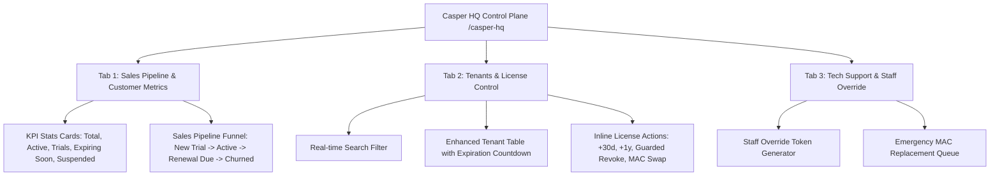

# Goal Description

Transform the **Casper HQ Control Plane (`/casper-hq`)** into an enterprise-grade SaaS Management Hub. This hardened plan integrates:
1. **Sales Pipeline & Customer Metrics Tab**: KPI summary cards, customer stage breakdown (Trial, Active, Renewal Due, Suspended/Expired), and interactive sales funnel tracking.
2. **Enhanced License Expiration Observability & Quick Actions**: UTC-safe expiration countdowns, status badges ("Expiring in X days"), 1-click renewal buttons (+30 days, +1 year), and guarded revocation with double-confirmation dialogs.
3. **Dedicated Technical Support & Staff Override Tab**: Centralized location for HQ support teams to issue signed 5-minute RS256 override tokens for offline field technicians and review emergency MAC swap requests.

---

## Technical Best Practice & Architectural Recommendations

### 1. Why Keep "Staff Override" in HQ?
**HQ is the only secure location holding `LICENSE_PRIVATE_KEY`.** When a local POS terminal is locked or offline, the field technician calls HQ support. HQ support inputs the terminal's Challenge Code + Machine ID into HQ to sign a 5-minute JWT override key. Moving this to a dedicated **"Technical Support" tab** keeps the main sales dashboard clean while giving support reps instant access.

### 2. Multi-Tab Architecture for HQ Control Plane
Instead of a single dense page, HQ features 3 clean, tabbed views:
- **📊 أنبوب المبيعات والعملاء (Sales Pipeline & Customer Metrics)**
- **🔑 التراخيص والعملاء (Tenants & License Control)**
- **🛠️ الدعم الفني والتجاوز (Technical Support & Staff Override)**

---

## User Review Required

> [!IMPORTANT]  
> Destructive actions like **Revoking a License** are now explicitly guarded with a confirmation modal (`AlertDialog`) to prevent accidental client lockouts.

> [!TIP]  
> Clicking any KPI card in the Sales Pipeline tab (e.g. "Expiring Soon") will automatically switch to the Tenants tab and pre-filter the list.

---

## Proposed Changes

### Components Layer

#### 1. `src/components/hq/SalesPipelineTab.tsx` [NEW]
- **KPI Metrics Cards**:
  - إجمالي العملاء (Total Customers)
  - اشتراكات نشطة (Active Subscribers)
  - فترات تجريبية (Active Trials)
  - مستحق التجديد خلال 7 أيام (Renewal Due < 7 Days)
  - معطل / منتهي (Expired or Suspended)
- **Pipeline Stage Breakdown (Sales Pipeline)**:
  - Interactive visual cards showing tenant count and percentage across stages:
    1. **جديد / تجريبي (Trial Stage)**
    2. **عميل مستمر (Active Subscriber)**
    3. **تنبيه تجديد (Renewal Alert)**
    4. **متوقف / مفقود (Churned/Expired)**

#### 2. `src/components/hq/TenantsManagementTab.tsx` [NEW]
- Interactive table with real-time search (filters by Tenant Name, Domain/Slug, License Key, MAC Address).
- **License Expiration Column**:
  - Exact UTC date & countdown badge (e.g. `ينتهي خلال 5 أيام`, `منتهي منذ يومين`, `مدى الحياة`).
  - Color-coded indicator: Green (Healthy > 14d), Yellow (Expiring soon <= 7d), Red (Expired/Suspended).
- **Inline License Actions (`LicenseQuickActions.tsx`)**:
  - `+30 يوم` (Extend 30 Days)
  - `+1 سنة` (Extend 365 Days)
  - `إيقاف / تفعيل` (Toggle Active Status)
  - `نسخ الكود` (Copy License Key)
  - `إلغاء الترخيص` (Guarded Revoke with `AlertDialog`)
  - `موافقة استبدال الجهاز` (Approve Emergency MAC Swap if triggered)

#### 3. `src/components/hq/TechSupportTab.tsx` [NEW]
- **Staff Override Token Generator**:
  - Form: Challenge Code + Machine ID -> Sign 5-minute RS256 JWT Token.
  - Quick-copy generated token text area with technician instructions.
  - Prominent warning badge regarding 5-minute validity window.
- **Emergency MAC Swaps Queue**:
  - Active list of terminals requesting hardware emergency override.

#### 4. `src/components/hq/HQDashboardClient.tsx` [NEW]
- Wrapper component holding tab state (`activeTab: 'pipeline' | 'tenants' | 'support'`).
- Handles `useTransition` + `router.refresh()` for instant optimistic revalidation on license mutations.

---

### Pages Layer

#### `src/app/(admin)/casper-hq/page.tsx` [MODIFY]
- Query all tenants and licenses from Postgres DB with rich includes.
- Compute aggregate metrics for the sales pipeline on the server.
- Enforce Super Admin auth check.
- Pass data to `<HQDashboardClient />`.

---

## Error Handling Matrix

| Scenario | Handler | User Message |
|----------|---------|--------------|
| `LICENSE_PRIVATE_KEY` missing | API Catch | `خطأ بالسيرفر: مفتاح التوقيع غير مهيأ` |
| Empty Challenge or Machine ID | Frontend Validation | `يرجى إدخال كود التحدي ورقم الجهاز` |
| License renewal network failure | Catch block | `تعذر تجديد الترخيص، تحقق من الاتصال` |
| Revoke Action Confirmation | AlertDialog | `هل أنت أكتد من إلغاء هذا الترخيص؟ سيتوقف الجهاز خلال 6 ساعات` |

---

## Verification Plan

### Automated Tests
- TypeScript compilation & Next.js build (`npm run build`).

### Manual Verification
1. Open `/casper-hq` in browser.
2. Test switching between the 3 tabs: **Sales Pipeline**, **Tenants & Licenses**, **Tech Support**.
3. Verify KPI numbers match the actual count of DB records.
4. Test real-time search filter in the Tenants tab.
5. Perform a +30 day extension on a test license and verify table revalidates dynamically.
6. Trigger `Revoke` and confirm `AlertDialog` prevents immediate execution unless confirmed.
7. Generate a Staff Override Token using a dummy Challenge & Machine ID in the Support tab.
