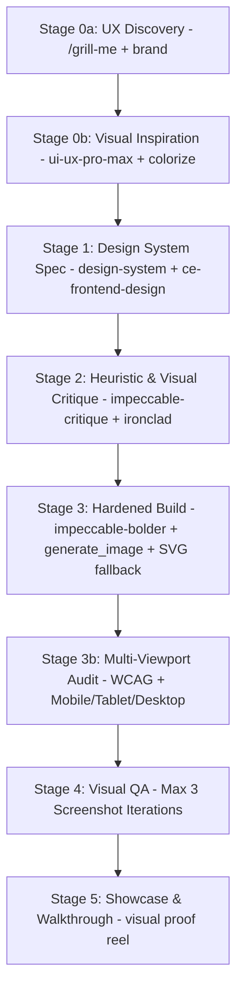

# Plan: Full-Throttle Autonomous UI/UX Design Pipeline (`/ui-pipeline`)

## 1. Goal & Architecture

Translate the 7-stage software `/pipeline` architecture into a specialized **Full-Throttle Autonomous UI/UX Design Pipeline (`/ui-pipeline`)**. This orchestrates the complete UI design lifecycle from UX discovery, token systems, visual critique, high-end code implementation (glassmorphism, micro-animations, rich typography), WCAG accessibility audits, asset fallbacks, and browser screenshot visual QA across multi-viewports.

---

## 2. Hardened 7-Stage UI/UX Design Sequence

### Stage Breakdown

| Stage | Name | Key Skills / Tools | Hardened Requirement | Verification |
| :--- | :--- | :--- | :--- | :--- |
| **0a** | **UX Discovery** | `/grill-me`, `brand` | Clarify user personas, design mood (glassmorphic, luxury dark, bento, modern minimalist), & key user actions. | ✅ PASSED |
| **0b** | **Visual Inspiration** | `ui-ux-pro-max`, `impeccable-colorize`, `impeccable-typeset` | Select color palette (HSL/OKLCH), typography scale, and visual topology. Output `design_tokens.css`. | ✅ PASSED |
| **1** | **Design System Spec** | `design-system`, `ce-frontend-design` | Map 3-layer tokens (primitive -> semantic -> component) & wireframe layout. Output `ui_design_spec.md`. | ✅ PASSED |
| **2** | **Heuristic Stress-Test** | `impeccable-critique`, `ironclad-review` | 2-Pass audit: Nielsen 10 Heuristics, visual hierarchy, WCAG contrast. Gate: `DESIGN_SCORE >= 90%`. | ✅ PASSED |
| **3** | **Hardened Build** | `impeccable-bolder`, `impeccable-animate`, `generate_image` | Implement components with smooth gradients, glassmorphism, micro-animations, and SVG fallback if image generator unavailable. | ✅ PASSED |
| **3b** | **Multi-Viewport Audit**| `impeccable-audit` | Audit WCAG Accessibility, Dark/Light mode harmony, and zero layout shift across 3 viewports (375px, 768px, 1440px). | ✅ PASSED |
| **4** | **Visual QA** | `ce-design-iterator`, Chrome subagent | Render page in browser, capture screenshot, run max `N=3` visual comparison cycles. | ✅ PASSED |
| **5** | **Showcase & Walkthrough**| `walkthrough.md`, `ce-demo-reel` | Generate visual proof reel with before/after screenshots and component inventory. | ✅ PASSED |

---

## 3. Implementation Units

### Unit 1: UI Design Pipeline Skill (`.agents/skills/design-pipeline/SKILL.md`)
- Define `/ui-pipeline` skill instructions with image fallbacks, multi-viewport audits, and `N=3` screenshot iteration caps.

### Unit 2: UI Design Pipeline Workflow (`.agents/workflows/ui-pipeline.md`)
- Create workflow runner steps to reflect hardened multi-viewport sequence.

---

## 4. Verification & Testing Plan

- Dry-run `/ui-pipeline` on a target UI module. Confirm HSL tokens, SVG image fallbacks, multi-viewport audits (mobile/tablet/desktop), and max 3 visual QA iterations.
