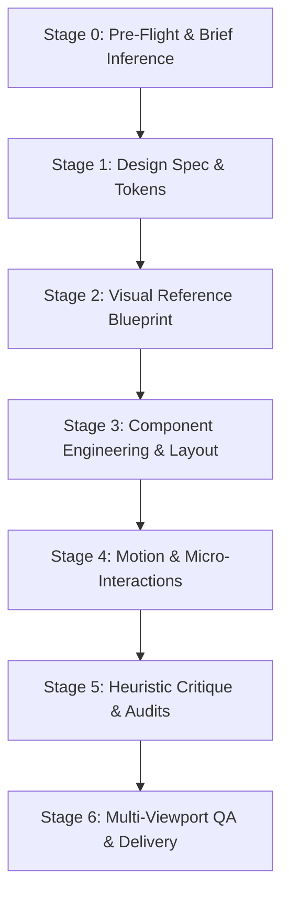

# feat: UI/UX & Taste Pipeline Step-by-Step Execution Framework

## Overview
A formalized, deterministic 7-stage pipeline to convert raw feature briefs into production-grade, state-of-the-art web/desktop UI using the newly integrated Taste & UI suite (`design-taste-frontend`, `high-end-visual-design`, `gpt-taste`, `magic-ui`, `impeccable`, and `ui-pipeline`).

---

## The 7-Stage Execution Pipeline

---

## Detailed Step-by-Step Walkthrough & Tool Mapping

### Stage 0: Pre-Flight & Brief Inference
* **Primary Skill**: `.agents/skills/design-taste-frontend/SKILL.md`
* **Objective**: Deduce product vibe, anti-slop rules, and typography hierarchy before touching code.
* **Actions**:
  1. Activate `.agents/skills/full-output-enforcement/SKILL.md` to prevent LLM truncation.
  2. Run brief inference to output a 1-line "Design Read" (e.g. *Industrial Swiss Data-Dense POS* vs. *Luxury Editorial Retail*).
  3. Select archetype: `industrial-brutalist-ui`, `minimalist-ui`, `Apple Minimal`, or `Bento Grid`.

### Stage 1: Design Tokens & System Specification
* **Primary Skill**: `.agents/skills/designmd/SKILL.md` & `.agents/skills/stitch-design-taste/SKILL.md`
* **Objective**: Establish single source of truth for design tokens.
* **Actions**:
  1. Generate or update `DESIGN.md` in repo root.
  2. Define OKLCH/HSL palettes (Primary, Surface Layers 1-3, Border 1-2, Accent).
  3. Set font pairing from `.agents/skills/ui-ux-pro-max/SKILL.md` (e.g. Plus Jakarta Sans + JetBrains Mono).

### Stage 2: Visual Reference Blueprint
* **Primary Skill**: `.agents/skills/refero/SKILL.md` & `.agents/skills/imagegen-frontend-web/SKILL.md`
* **Objective**: Remove guesswork via real-world production references.
* **Actions**:
  1. Search 150k+ production screens for flow patterns.
  2. Generate section-by-section visual direction images (`imagegen-frontend-web` / `generate_image`).

### Stage 3: Component Engineering & Bento Topology
* **Primary Skill**: `.agents/skills/high-end-visual-design/SKILL.md` & `.agents/skills/magic-ui/SKILL.md`
* **Objective**: Implement high-end tactile components.
* **Actions**:
  1. Construct layouts with gapless Bento grids and double-bezel cards (`high-end-visual-design §4`).
  2. Integrate Magic UI animated components (Border Beam, Shimmer Button, Animated Bento, Marquee).
  3. Ensure RTL/LTR bidirectional support.

### Stage 4: Motion & Micro-Interactions
* **Primary Skill**: `.agents/skills/gpt-taste/SKILL.md` & `.agents/skills/impeccable-animate/SKILL.md`
* **Objective**: Provide subtle, tactile feedback without blocking transactional workflows.
* **Actions**:
  1. Apply GSAP / CSS scroll-driven animations and pinning where appropriate.
  2. Add cubic-bezier easing for hovers, button clicks, and modal entrances.
  3. Include `prefers-reduced-motion` fallbacks.

### Stage 5: Heuristic Critique & Technical Quality Audit
* **Primary Skill**: `.agents/skills/impeccable-critique/SKILL.md` & `.agents/skills/impeccable-audit/SKILL.md`
* **Objective**: Rigorous automated quality gate.
* **Actions**:
  1. Run `.agents/skills/impeccable-critique/SKILL.md` to evaluate visual hierarchy (Target score: >=90%).
  2. Run `.agents/skills/impeccable-audit/SKILL.md` across Mobile (375px), Tablet (768px), and Desktop (1440px).
  3. Enforce WCAG AA 4.5:1 text contrast minimums.

### Stage 6: Visual QA & Final Polish
* **Primary Skill**: `.agents/workflows/ce-design-iterator.md` & `.agents/skills/impeccable-polish/SKILL.md`
* **Objective**: Screenshot iteration and zero-defect polish.
* **Actions**:
  1. Capture live browser screenshots via Chrome subagent.
  2. Iterate up to N=3 cycles on detected visual anomalies.
  3. Produce visual demo reel artifact.

---

## Implementation Units

- [ ] **Unit 1**: Baseline Design Tokens (`DESIGN.md` extraction & CSS variable binding)
- [ ] **Unit 2**: Layout Structure (Bento grid / Dual-Pane Layout with double-bezel surfaces)
- [ ] **Unit 3**: Component & Motion Integration (Magic UI + Micro-interactions)
- [ ] **Unit 4**: Responsive & Accessibility Validation (Impeccable audit across 3 breakpoints)
